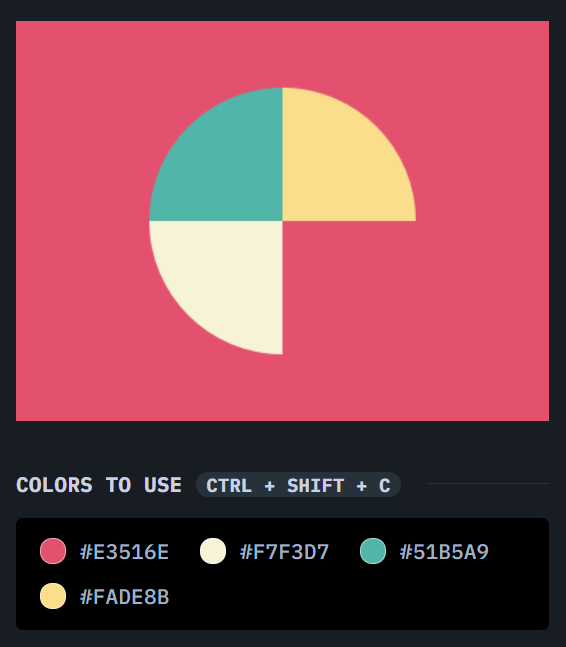
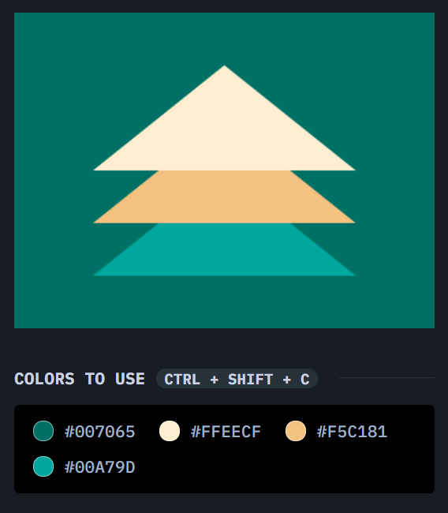

# Concept Class Nov-17-2021

## Content Covered
- Pseudo Elements
    - Difference between Pseudo Classes and Pseudo Elements - Pseudo classes are selectors which are applied to whole (complete) HTML element whereas Pseudo elements are applied to only a part of your HTML element.
- Combinators
    - Ancestor / Descendant.
        - Parent / Child (Angular Bracket)
        - Descendant (Space)
    - Siblings.
        - General Sibling (Tilde)
        - Adjacent Sibling (Plus)
- Priority
- Box Model
- Attribute Selectors
- ***Apply various CSS selectors to Unordered List***
- ***Create Shapes (Squares, Circles and Triangles) using CSS***

## Resources
- https://www.youtube.com/watch?v=l1mER1bV0N0
- https://www.youtube.com/watch?v=cYyIRmRWjG0
- https://developer.mozilla.org/en-US/docs/Web/CSS/Pseudo-elements
- https://developer.mozilla.org/en-US/docs/Learn/CSS/Building_blocks/Selectors/Combinators
- https://developer.mozilla.org/en-US/docs/Web/CSS/Descendant_combinator
- https://developer.mozilla.org/en-US/docs/Web/CSS/Child_combinator
- https://developer.mozilla.org/en-US/docs/Web/CSS/General_sibling_combinator
- https://developer.mozilla.org/en-US/docs/Web/CSS/Adjacent_sibling_combinator
- https://developer.mozilla.org/en-US/docs/Learn/CSS/Building_blocks/The_box_model
- https://developer.mozilla.org/en-US/docs/Web/CSS/Attribute_selectors

## Assignment
- Create a CSS based figure which should look similar to the below shared images.
- 
- 

### Further Interest
- More about Attribute pattern matching, Star (*), Dollar ($) and Tilde (~)
- https://developer.mozilla.org/en-US/docs/Web/CSS/Attribute_selectors
- https://www.youtube.com/watch?v=PEA_s3O5iak
- https://www.youtube.com/watch?v=3owx2vJHkv4
- https://www.youtube.com/watch?v=al81Rrh-TXw

---

> *"Software is the magic thing whose importance only goes up over time."*- Bill Gates