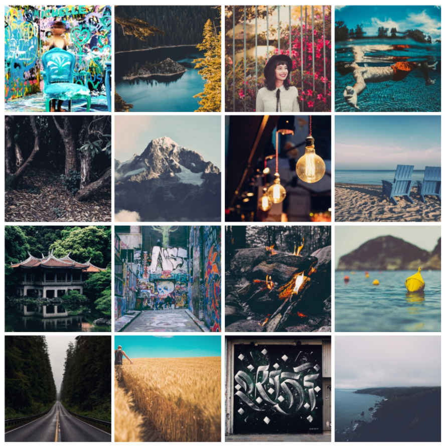
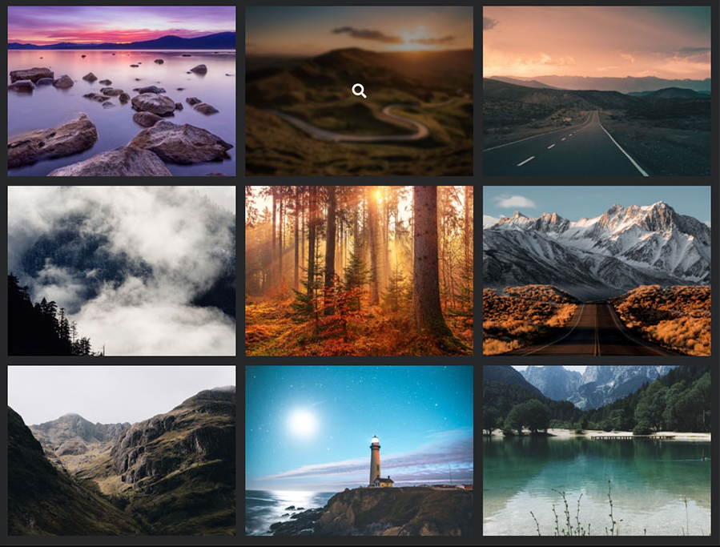
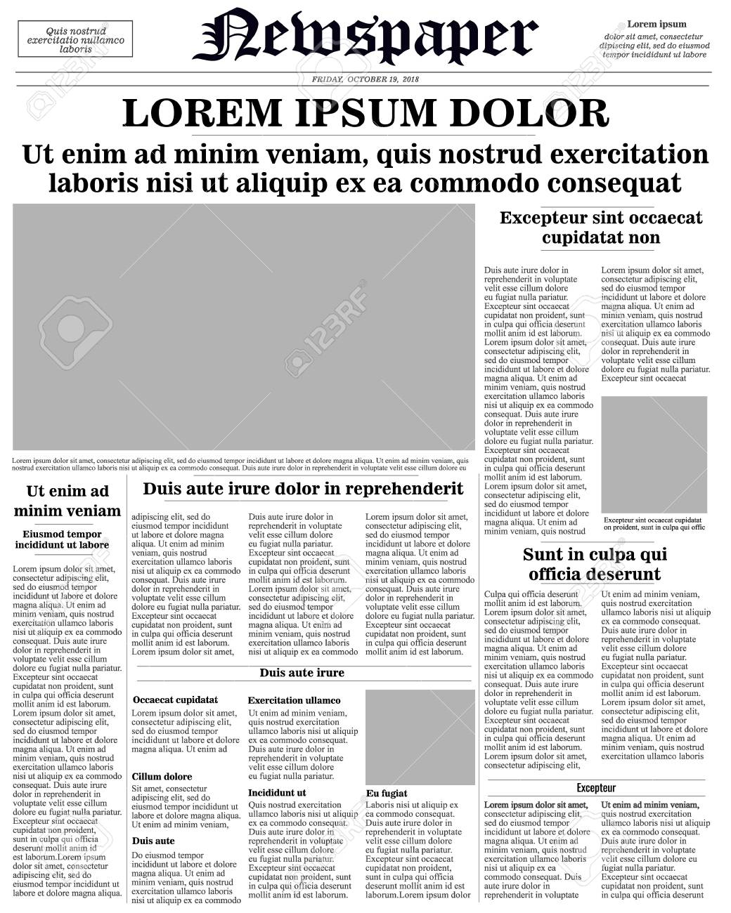

# Concept Class Nov-18-2021

## Content Covered
- Box Model
- Layouting -> The way in which the html elements are arranged or laid out in the webpage.
    - Block Layout
    - Float Layout
    - Flex (Flexbox) Layout:
        - display: flex;
        - flex-direction: row | column | row-reverse | column-reverse;
        - justify-content: start | end | left | right | center | space-between | space-evenly | space-around;
        - flex-wrap: wrap | nowrap;
        - gap / row-gap / column-gap
    - Use of start | end vs left | right.
    - Responsiveness -> How responsive a website is. If it is more responsive, the responsiveness is high, otherwise low.
    - Responsive -> The ability of a website to adapt to different (various) screen sizes.
- ***Demonstrate the use of different justify content.***
- ***Center align an item in the center.***
- ***Create a layout similar to Facebook.***

## Resources
- https://developer.mozilla.org/en-US/docs/Web/CSS/float
- https://developer.mozilla.org/en-US/docs/Web/CSS/CSS_Flexible_Box_Layout
- https://developer.mozilla.org/en-US/docs/Web/CSS/display
- https://developer.mozilla.org/en-US/docs/Web/CSS/flex-direction
- https://developer.mozilla.org/en-US/docs/Web/CSS/justify-content
- https://developer.mozilla.org/en-US/docs/Web/CSS/flex-wrap
- https://developer.mozilla.org/en-US/docs/Web/CSS/gap
- https://developer.mozilla.org/en-US/docs/Web/CSS/row-gap
- https://developer.mozilla.org/en-US/docs/Web/CSS/column-gap
- https://developer.mozilla.org/en-US/docs/Learn/CSS/CSS_layout/Responsive_Design
- https://www.youtube.com/watch?v=K74l26pE4YA

## Assignment
1. Create a responsive image gallery using Flexible Box.
    - 
    - 
2. Create a webpage looking like a newspaper.
    - 

### Further Interest
- https://developer.mozilla.org/en-US/docs/Web/CSS/CSS_Flow_Layout/Block_and_Inline_Layout_in_Normal_Flow
- https://www.youtube.com/watch?v=vQAvjof1oe4&t=57s

---

> *"Most good programmers do programming not because they expect to get paid or get adulation by the public, but because it is fun to program."*- Linus Torvalds