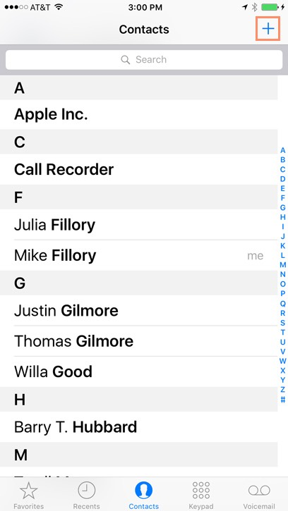
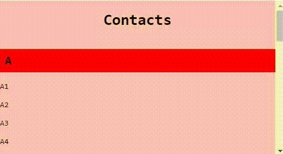
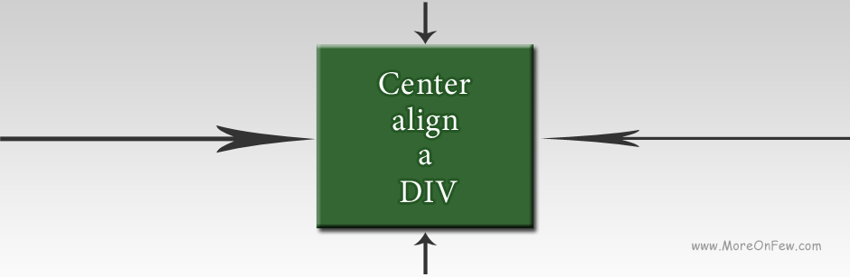

# Concept Class Nov-22-2021

## Content Covered
- Recap on Position
- Position other values
    - sticky
    - Absolute
    - Relative
    - Difference between Position Fixed and Position Absolute?
        - **Fixed is with respect to the viewport whereas Absolute is with respect to the closest positioned ancestor.**
        - **Ancestor** -> Parent element / Grand parent element / Great grand parent element / etc. etc.
        - **Positioned** -> Any element who has position style value that is not static.
        - **Closest** -> Whichever is closest.
- Units and Measurements
    - Pixels (px)
    - Percentages (%)
    - Elements & Root Elements (em & rem)
    - Viewport Height and Viewport Width (vh & vw)
- ***Convert the Navigation bar and use sticky***
- ***Use absolute positioning inside other positioned element***
- ***Add two sticky nav bars one after another***

## Resources
- https://developer.mozilla.org/en-US/docs/Learn/CSS/CSS_layout/Positioning
- https://developer.mozilla.org/en-US/docs/Learn/CSS/CSS_layout/Position_skills
- https://developer.mozilla.org/en-US/docs/Learn/CSS/Building_blocks/Values_and_units
- https://www.element84.com/blog/responsive-typography
- **Good watch** -> https://www.youtube.com/watch?v=dHbYcAncAgQ
- https://www.youtube.com/watch?v=-GR52czEd-0
- https://www.youtube.com/watch?v=N5wpD9Ov_To

## Assignment
- Create a contact list like page where all the names starting with a character will have that character name in the navigation bar. It can look something like this. Also the functionality can be something like this.
    - 
    - 
- Create a div which is center aligned in the webpage. It has to be center aligned both vertically as well as horizontally.
    - 

---

> *"If you can’t make it good, at least make it look good."*- Bill Gates