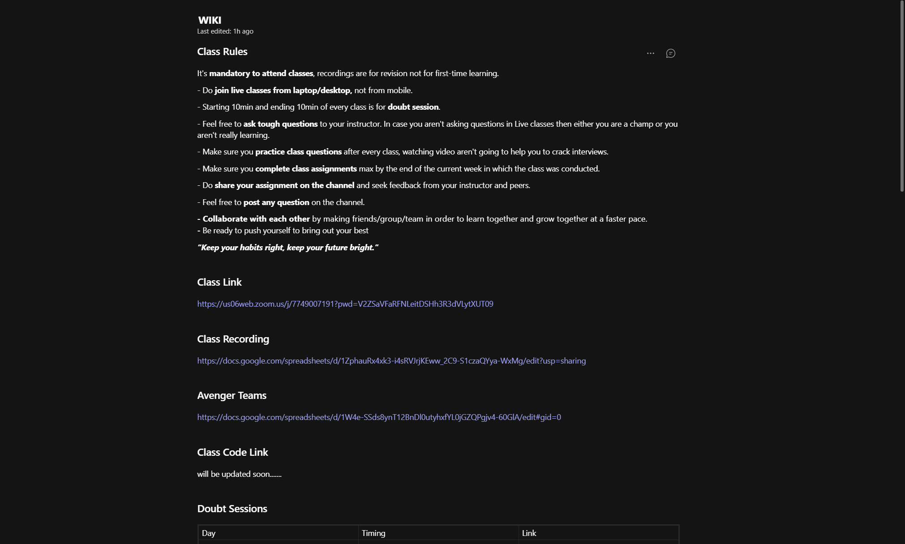
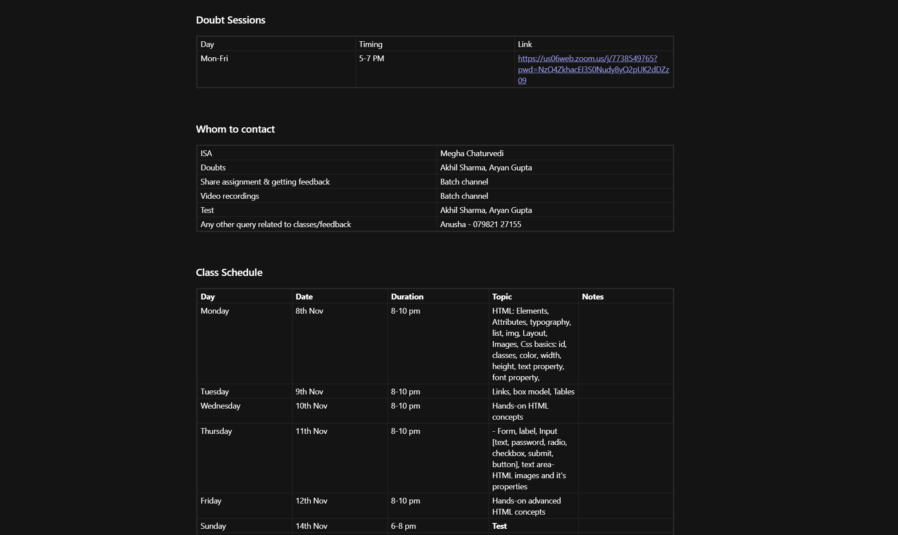

# Practice Class Nov-10-2021

## Content Covered
- Revision
- Input
- Pattern (Regular Expression)
- ***Create Regular Expression Pattern to validate email***
- Div
- Background Color
- Border:
    - Width
    - Color
    - Style
    - Radius
- Adding Custom Font:
    - From a link
    - From a TTF File
- ***Clone Google***
- Textarea

## Resources
- **Uploading to Github Pages** - https://www.youtube.com/watch?v=EhzmzXY8He4
- https://developer.mozilla.org/en-US/docs/Web/HTML/Element/input
- https://developer.mozilla.org/en-US/docs/Web/JavaScript/Guide/Regular_Expressions
- https://developer.mozilla.org/en-US/docs/Web/HTML/Element/div
- https://developer.mozilla.org/en-US/docs/Web/CSS/background-color
- https://developer.mozilla.org/en-US/docs/Web/CSS/border-width
- https://developer.mozilla.org/en-US/docs/Web/CSS/border-color
- https://developer.mozilla.org/en-US/docs/Web/CSS/border-style
- https://developer.mozilla.org/en-US/docs/Web/CSS/border-radius
- https://www.youtube.com/watch?v=Hwq_Mr12bcI
- https://developer.mozilla.org/en-US/docs/Web/HTML/Element/textarea

## Assignment
- Create a webpage looking similar to the Wiki section of Microsoft Teams.
- It should look same as close as possible to the WIKI section.
- 
- 
- It is okay if the content does not match, you can use dummy content.
- What is required is that it should look as same as possible.
- Things to match (Font, style, color, background color, list, anchor, table, border).
- You can go creative and add additional things like comments icon and side navigation (☰ icon) with functionality. 

### Further Interest
- Add fontawesome icons - https://www.youtube.com/watch?v=lMBa7gLWyO4
- Regular Expressions in Depth - https://www.youtube.com/watch?v=rhzKDrUiJVk

---
> *"Good software, like wine, takes time."*- Joel Spolsky