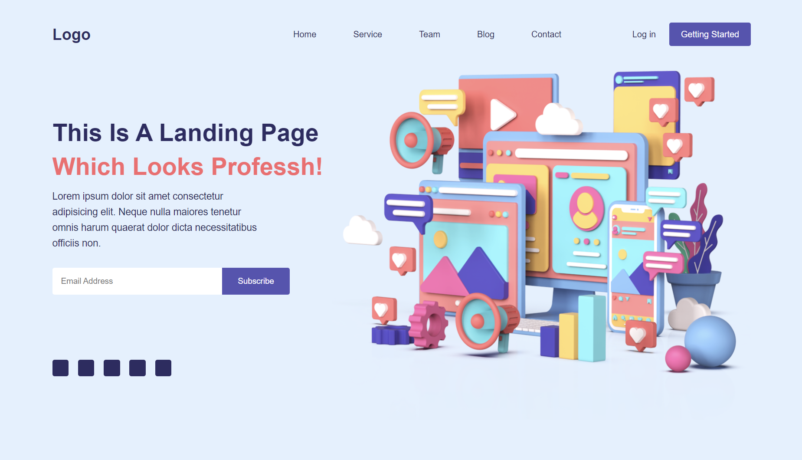
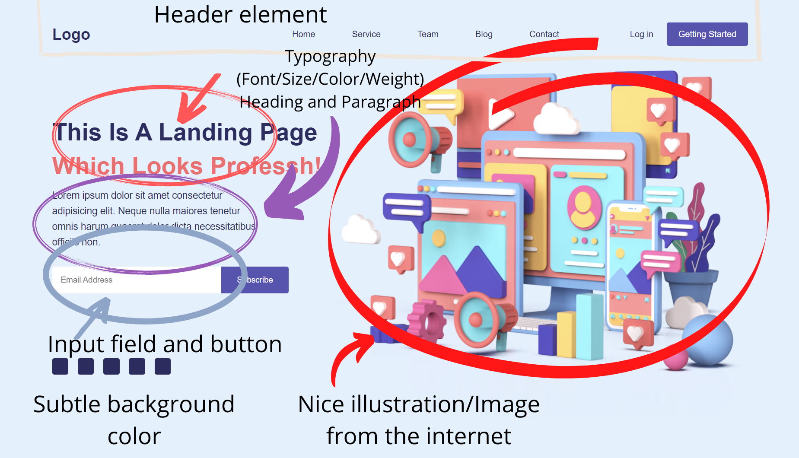

# Practice Class Nov-12-2021

## Content Covered
- Revision
- ***Create an OTP Login Form***
- Display inline-block
- Margin in % values
- text-align: center

## Resources
- To make page beautiful:
    - **Inspiration:**
        - Dribbble (https://dribbble.com)
    - **Color Scheme:**
        - ColorHunt (https://colorhunt.co)
        - Coolors (https://coolors.co)
        - Google Color Picker (https://www.google.com/search?q=google+color+picker)
    - **Typography:**
        - Google Fonts (https://fonts.google.com)
        - Use Emoji as icons. (`Win` + `.` for Windows)
    - **Background Images/Illustrations:**
        - Blobs App (https://blobs.app)
        - Blobmaker (https://www.blobmaker.app)
        - Undraw (https://undraw.co/illustrations)
        - Humaaans (https://www.humaaans.com)
        - OpenDoodles (https://www.opendoodles.com)
        - Absurd Design (https://absurd.design)
        - Freepik (https://www.freepik.com)
        - Icons8 (https://icons8.com/illustrations)
        - Drawkit (https://drawkit.com)
- Sample Landing page attached. 👇🏻
- 
- Now, we can break the landing page to very fundamental concepts. 👇🏻
- 
- Most of the landing pages follow a very similar design. The only thing that differentiates is the choice of Color + Typography + illustration/Image used.

## Assignment
- Create your own landing page.
- A landing page is the first page of your website. It can be of anything, it can be for a business promoting some product or even your own portfolio.
- Go creative, the more good looking page you make, the more points you get.

### Further Interest
- Null for this one.

---
> *"Software is a great combination between artistry and engineering."*- Bill Gates