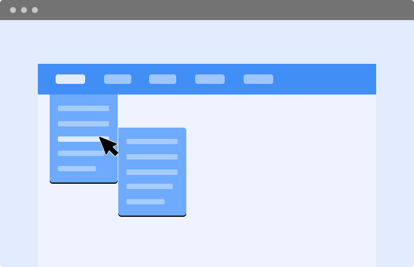
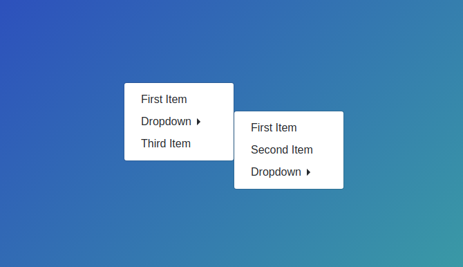

# Practice Class Nov-16-2021

## Content Covered
- CSS Selectors -> These are used to apply style properties to a single (or multiple) specific HTML elements.
    - Classification of Selectors: (Broadly into 3 Parts/Types, Technically into 4 Parts/Types):
        - Type / ID / Class / Universal
        - Attribute
        - Pseudo Selectors
        - Combinators
    - Group Selector -> A selector which is made up of multiple different selectors. (Group of Selectors).
    - Tag Selector
    - ID Selector
    - Class Selector
    - Universal Selector
    - Pseudo Selectors - Only Pseudo Classes
        - Hover
        - First Child
        - Last Child
        - nth-child
    - AND + OR of mutiple Selectors
- ***Create a List of Items with various selectors***
- ***Create a Table and do alternate background rows***
- ***Create a dropdown menu button***

## Resources
- https://developer.mozilla.org/en-US/docs/Web/CSS/CSS_Selectors
- https://developer.mozilla.org/en-US/docs/Web/CSS/Type_selectors
- https://developer.mozilla.org/en-US/docs/Web/CSS/Class_selectors
- https://developer.mozilla.org/en-US/docs/Web/CSS/ID_selectors
- https://developer.mozilla.org/en-US/docs/Web/CSS/Selector_list
- https://developer.mozilla.org/en-US/docs/Web/CSS/Pseudo-classes
- https://developer.mozilla.org/en-US/docs/Web/CSS/:nth-child
- https://developer.mozilla.org/en-US/docs/Web/CSS/:first-child
- https://developer.mozilla.org/en-US/docs/Web/CSS/:last-child

## Assignment
- On the wiki table. Give alternating background color.
- Make sub item hover. (Multilevel Dropdown)
- It will look something like this. 👇🏻
- 
- 

### Further Interest
- https://www.youtube.com/watch?v=kpXKwDGtjGE

---
> *"Always remember, your focus determines your reality."*- George Lucas